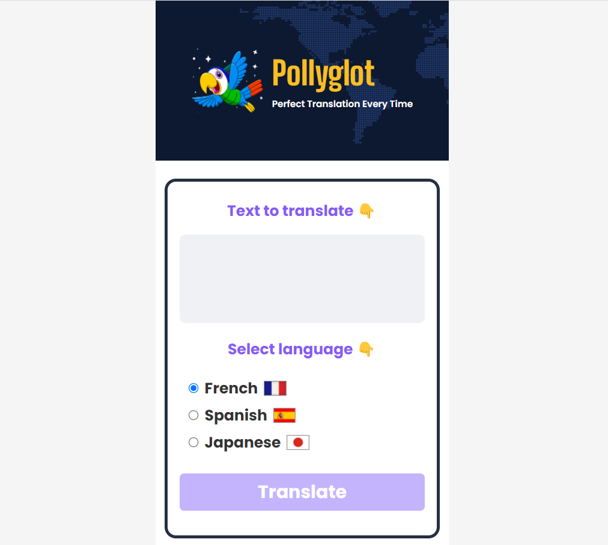

# pollyglot
Translate anything with just a click using AI

<center>
    
</center>

## How to run
First, clone this repository
```
git clone https://github.com/dhelarius/pollyglot.git
```
- `cd pollyglot`: access to project root
- `npm install`: install all dependencies
- `npm run dev`: run the project on development environment
- `npm run build`: build the project for production

> [!NOTE]  
> An OpenAI API key is necessary for this project to work. You can get an OpenAI api key on https://platform.openai.com/account/api-keys, then paste it in the **VITE_OPENAI_API_KEY** environment variable in **.env** file.